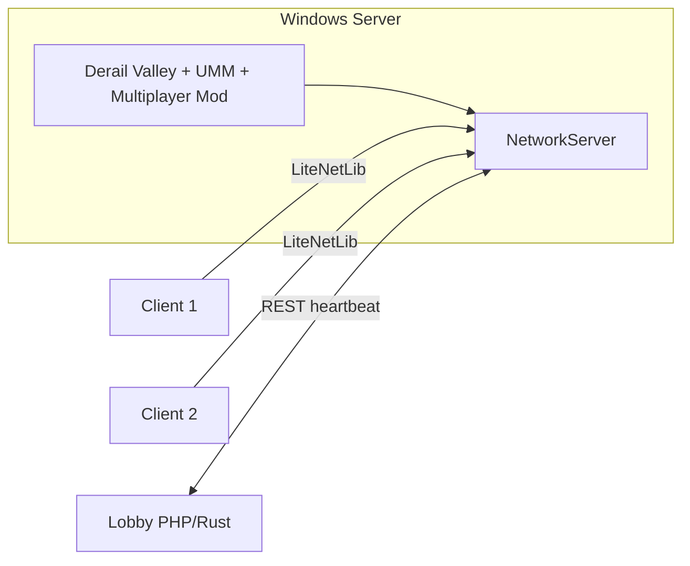

# AGENT.md — Cursor-Agent Kontext & Aktivitätslog

Diese Datei dokumentiert den Projektüberblick für KI-Agenten und protokolliert alle relevanten Agenten-Aktivitäten in diesem Repository.

---

## Projektüberblick

| Feld | Wert |
|------|------|
| **Name** | Derail Valley Multiplayer |
| **Typ** | Unity Mod Manager (UMM) Mod für [Derail Valley](https://store.steampowered.com/app/588030) |
| **Lizenz** | Apache 2.0 |
| **Upstream** | Fork/Fortführung von [Insprill/dv-multiplayer](https://github.com/Insprill/dv-multiplayer), aktiv bei [AMacro/dv-multiplayer](https://github.com/AMacro/dv-multiplayer) |
| **Lokales Remote** | `https://github.com/TechausCon/dv-multiplayer.git` |
| **Standard-Branch** | `beta` |
| **Mod-Version** (`info.json`) | `0.1.14.0` |
| **Multiplayer-API (built against)** | `1.1.0.0` (`APIProvider.BUILT_AGAINST_API_VERSION`) |

### Kurzbeschreibung

Ein Spieler hostet eine Session, andere joinen per **LiteNetLib** (24 Hz Tick). Vanilla-Fokus; andere Mods gelten als inkompatibel, bis explizit unterstützt. Nexus-Release: [Mod 1070](https://www.nexusmods.com/derailvalley/mods/1070).

---

## Repository-Struktur

```
dv-multiplayer/
├── Multiplayer/              # Hauptmod (~33k Zeilen C#)
│   ├── Multiplayer.cs        # UMM Entry: Load(), Harmony PatchAll, Assets, NetworkLifecycle
│   ├── Patches/              # Harmony-Patches (World, Train, Jobs, SaveGame, Player, Mods, …)
│   ├── Networking/           # LiteNetLib, Packets, Serialization, Managers
│   ├── Components/           # Unity-Verhalten (Networking, UI, SaveGame, MainMenu)
│   └── API/                  # IMultiplayerAPI-Implementierung (APIProvider)
├── MultiplayerAPI/           # Öffentliche API für Drittmods (MPAPI-Namespace)
├── MultiplayerAPI Tests/     # API-Tests
├── MultiplayerAssets/        # Unity 2019.4.40f1 — AssetBundles, Prefabs, Editor-Scripts
├── Lobby Servers/
│   ├── PHP Server/           # Lobby-Listing (Flatfile/MySQL)
│   ├── Rust Server/          # Alternative Lobby-Implementierung
│   └── RestAPI.md            # REST-Spezifikation für Server-Registry
├── build/                    # Build-Artefakte (AssetBundle, DLLs) — oft aus Release kopiert
├── info.json                 # UMM-Mod-Metadaten
├── locale.csv                # Übersetzungen
├── Multiplayer.sln
└── Directory.Build.targets.EXAMPLE  # Pfade zu DV-Install & Unity (lokal kopieren/anpassen)
```

---

## Architektur (Kern)

### Startup (`Multiplayer.Load`)

1. Settings & Locale laden  
2. **Harmony** `PatchAll()` (+ optionale Patches z. B. RemoteDispatch)  
3. AssetBundle laden (`multiplayer.assetbundle`, `AssetIndex`)  
4. `NetworkLifecycle.CreateLifecycle()`  
5. `ModCompatibilityManager`, `APIProvider` registrieren  
6. API-Versionscheck: geladene `MultiplayerAPI.LoadedApiVersion` ≥ `BUILT_AGAINST_API_VERSION`

### Netzwerk

| Komponente | Rolle |
|------------|--------|
| `NetworkLifecycle` | Singleton: Server + Client, Tick 24/s, Lobby-Daten, Host-Erkennung |
| `NetworkServer` / `NetworkClient` | Erweitern `NetworkManager`, LiteNetLib |
| Packets | `Serverbound/`, `Clientbound/`, `Common/`, `Unconnected/` |
| `NetIdProvider` | Netzwerk-IDs für Game-Objekte |
| `RpcManager` | RPC-Handling |

### Patches

Harmony-Patches spiegeln Spielzustand und leiten Änderungen in Netzwerk-Packets. Bereiche: **Train**, **World** (Items, Junctions, …), **Jobs**, **SaveGame**, **Player**, **MainMenu**, **Mods** (Kompatibilität).

### MultiplayerAPI (`MPAPI`)

- Statische Fassade: `MultiplayerAPI.ServerStarted`, `ClientStarted`, Versionen  
- Interfaces: `IServer`, `IClient`, `IPlayer`, `IPacket`, `ISerializablePacket`  
- Wiki: [API Overview](https://github.com/AMacro/dv-multiplayer/wiki/API-Overview)

### Lobby-Server

Öffentliche Serverliste per REST (`RestAPI.md`): `add_game_server`, Updates, Deregistrierung. Implementierungen: PHP oder Rust.

---

## Build & Entwicklung

### Voraussetzungen

- **Unity Editor 2019.4.40f1** für `MultiplayerAssets`  
- **.NET** Solution: `Multiplayer.sln`  
- `Directory.Build.targets` aus `.EXAMPLE` kopieren und `DvInstallDir` / `UnityInstallDir` setzen  
- Optional: Code-Signing (`Cert-Thumb`, `SignToolPath`)

### Unity-Build

Menü: `Multiplayer` → `Build Asset Bundle and Scripts` → Output nach `build/`

### C#-Build

Solution kompilieren (ggf. mehrfach). Debug: `harmony.log.txt` auf Desktop. Release: Signierung + Packaging.

### Wichtige Dateien

| Datei | Zweck |
|-------|--------|
| `info.json` | UMM Manifest (`EntryMethod`: `Multiplayer.Multiplayer.Load`) |
| `releases.json` | Update-Repository-Referenz |
| `locale.csv` | Lokalisierung |

### Konventionen (für Agenten)

- Namespaces spiegeln Ordnerstruktur (`Multiplayer.Networking.Packets.Clientbound.Train`, …)  
- Minimale Diffs; bestehende Patterns (Packets, Patches, NetId) wiederverwenden  
- Keine Commits/Pushes ohne explizite User-Anfrage  
- Mod-Kompatibilität nicht voraussetzen — Vanilla-first

---

## Bekannte Einschränkungen

- `IsDedicatedServer` in API: `false` (nicht implementiert)  
- Andere Mods können Multiplayer brechen  
- macOS-Entwicklung: Pfade in `Directory.Build.targets` zeigen typisch auf Windows-Steam/Unity-Installationen

---

## Planung: Dedicated Server (Windows)

> Status: **Konzept / nicht implementiert** — siehe Session 2026-06-01 unten.

### Ausgangslage im Code

| Thema | Ist-Zustand |
|-------|-------------|
| API | `APIProvider.IsDedicatedServer` → immer `false` |
| Host-Modell | `StartServer()` startet **immer** einen Loopback-Client (`NetworkLifecycle` Z.149) |
| Autorität | `IsHost()` = Server läuft; viele Patches prüfen Host für Simulation |
| Server-Logik | `NetworkServer` hängt stark an **DV + Unity** (`Globals`, `WorldStreamingInit`, `Networked*`-Komponenten) |
| Vorbereitung | Kommentare/TODOs in `NetworkServer.OnLoaded`, `ChatManager`, `CarVisitCheckerPatch` |
| Roadmap (README) | Dedicated Server **nach** stabilem Vanilla-Multiplayer |

**Wichtig:** Ein „Dedicated Server“ ist hier **kein** reiner LiteNetLib-Prozess wie bei Minecraft. Die Welt-Simulation läuft im **Derail-Valley-Spiel** (Unity). Die Lobby-Server (PHP/Rust) listen nur Server — sie simulieren nichts.

### Strategische Optionen

| Option | Beschreibung | Aufwand | Windows-tauglich |
|--------|--------------|---------|-------------------|
| **A – Headless Host (empfohlen MVP)** | DV + Mod auf Windows-Server, minimale/keine Grafik, Auto-Start per CLI | Mittel | Ja |
| **B – „Always-on Host“** | Volles Spiel minimiert im Hintergrund, gleiche Architektur wie heute | Gering | Ja (Ressourcen!) |
| **C – Logik extrahieren** | Server ohne Unity/DV — eigener Prozess | Sehr hoch | Langfristig |

Option **A** nutzt die bestehende `NetworkServer`-Architektur; Option **C** wäre ein Multi-Jahres-Refactor.

### Zielbild (Option A)



- Kein lokaler Spieler-Client auf dem Server (kein Loopback-`NetworkClient`)
- Welt wird **auf dem Server** geladen; Joiner synchronisieren wie heute (`ClientboundSaveGameDataPacket`, World-State, …)
- Admin über **Konsole / RCON / Web** statt Ingame-Host

### Phasen-Roadmap

#### Phase 0 — Machbarkeit (1–2 Wochen) ← **als Nächstes**

**Automatisierung:** `scripts/phase0/Invoke-Phase0Tests.ps1` — siehe [scripts/phase0/README.md](scripts/phase0/README.md).

Ziel: **Go/No-Go**, bevor Phase-1-Code. Gilt für **Hetzner** und **Heim-PC** (beide testen, wenn möglich).

| Schritt | Hetzner (Windows VPS) | Heim-PC |
|---------|------------------------|---------|
| OS | Windows Server 2022/2025, Desktop Experience | Windows 10/11 |
| Steam | SteamCMD + `app_update` DV; einmaliger Login | Bestehende Steam-Installation |
| Grafik | `-batchmode -nographics` testen; Fallback: minimiertes 800×600-Fenster | Gleich |
| Netz | UDP/TCP Spiel-Port + ggf. Steam-Ports in Firewall | Port-Forward Router → PC |
| Lizenz | Steam Guard / `steamcmd +login` | Meist unkritisch |

**Checkliste Phase 0:**

- [ ] DV-Version = Mod-`game_version` / Release-Branch
- [ ] UMM + Multiplayer-Mod installiert (Release-Build aus `beta`)
- [ ] Spiel startet mit `-batchmode -nographics` (oder Fallback) **ohne** Absturz in Hauptmenü
- [ ] Manuell Host starten (aktueller Mod): Career-Save laden, 2. Client von anderem PC joinen
- [ ] LiteNetLib: Join per **öffentlicher IP** (Hetzner) bzw. LAN/Port-Forward (Heim)
- [ ] Steamworks: Join per Steam-Lobby vom 2. Client (Host auf Testmaschine)
- [ ] 30+ Min Laufzeit: Züge fahren, Save, Wetter, Disconnect/Reconnect
- [ ] RAM/CPU messen: idle, 1 Spieler, 4 Spieler (`Task Manager` / Performance Counter)
- [ ] Hetzner: prüfen ob **GPU/Display** nötig (manchmal virtueller Monitor / Parsec nur für Setup)

**Go/No-Go-Kriterien:**

| Ergebnis | Bedeutung |
|----------|-----------|
| ✅ Career + Sandbox hostbar, Join stabil, Ressourcen akzeptabel | → Phase 1 starten |
| ⚠️ Nur mit Fenster stabil | → Dedicated = minimiertes Fenster, kein echtes Headless |
| ❌ Crash / kein Join / >16 GB RAM idle | → Architektur-Review (Streaming, Save-Größe) |

**Hetzner-Hinweis:** Viele VPS haben **keine GPU**; DV ist 3D-Unity — Phase 0 klärt, ob das ein Showstopper ist. Heim-PC ist oft der einfachere erste Test.

#### Phase 1 — Dedicated-Modus im Mod (Kern)

- [ ] `IsDedicatedServer`-Flag (CLI: `-dedicated` oder `+dedicated 1`)
- [ ] `NetworkLifecycle.StartDedicatedServer()`: nur Server, **kein** `StartClient(Loopback)`
- [ ] `IsHost()` / `IsHost(player)` semantisch trennen: `IsServerAuthority` vs. „menschlicher Host-Spieler“
- [ ] `NetworkServer.OnLoaded`: PitStops/CashRegisters ohne Client (Kommentar Z.250 umsetzen)
- [ ] Join-Flow: erster Spieler / Admin-Rolle; Host-Shortcut in `NetworkClient` (Z.460–464) für Dedicated überspringen
- [ ] `SelfId` / `SelfPeer`: Server-only ohne Client-`PlayerId`

#### Phase 2 — Autorität & Patches

- [ ] Alle `IsHost()`-Stellen auditieren (~50+ Treffer)
- [ ] `ChatManager`: Kick/Ban/Server-Commands für Dedicated-Admin (nicht `IsHost(sender)`)
- [ ] `CarVisitCheckerPatch`, Train-Distance, Jobs-Generation: Dedicated-Pfade testen
- [ ] Streaming: ohne Spieler-Kamera — `PlayerDistanceGameObjectsDisabler` anpassen

#### Phase 3 — Windows-Betrieb

- [ ] `DedicatedServer/` mit `server.config.json` (Port, Passwort, Save, Schwierigkeit, öffentlich ja/nein)
- [ ] Bootstrap-Skript: `Start-DedicatedServer.ps1` (Steam, DV, UMM, Mod, Args)
- [ ] Optional: Windows-Dienst (NSSM) oder geplante Aufgabe
- [ ] Firewall-Regel Dokumentation (UDP/TCP Port aus Settings)
- [ ] Logging: `multiplayer.log` + rotierendes Server-Log

#### Phase 4 — Lobby & API

- [ ] `LobbyServerManager` ohne Unity-GUI-Abhängigkeiten
- [ ] `MultiplayerAPI.IsDedicatedServer` korrekt exponieren
- [ ] Wiki/Docs: Hosting Dedicated on Windows

#### Phase 5 — Qualität (später)

- [ ] Dedizierte Admin-CLI (save, kick, status, shutdown)
- [ ] Auto-Save / Crash-Recovery
- [ ] Mod-Whitelist für Dedicated

### Betroffene Kern-Dateien (voraussichtlich)

- `Multiplayer/Components/Networking/NetworkLifecycle.cs`
- `Multiplayer/Networking/Managers/Server/NetworkServer.cs`
- `Multiplayer/Networking/Managers/Client/NetworkClient.cs`
- `Multiplayer/API/APIProvider.cs`
- `Multiplayer/Multiplayer.cs` (CLI-Args)
- `Multiplayer/Networking/Managers/Server/ChatManager.cs`
- Diverse `Patches/**` (Host-Checks)

### Risiken

| Risiko | Mitigation |
|--------|------------|
| DV unterstützt kein Headless | Minimiertes Fenster; ggf. virtueller Display |
| Lizenz / Steam-Login auf Server | SteamCMD + `-login` oder interaktiver einmaliger Login |
| Kein Spieler → Welt-Streaming | Server-seitige Streaming-Logik / Forced-Load-Zonen |
| Hoher RAM (gesamte Karte) | Sandbox vs. Career; Save-Größe begrenzen |
| Mod-Inkompatibilität | Strikt Vanilla-only auf Dedicated (wie README) |

### Produktentscheidungen (festgelegt 2026-06-01)

| # | Thema | Entscheidung |
|---|--------|--------------|
| 1 | **Spielmodus** | **Sandbox + Career** (MVP muss Career-Saves unterstützen) |
| 2 | **Admin** | **Festes Admin-Passwort** (nicht „erster Joiner“); normales Server-Passwort für Spieler getrennt halten |
| 3 | **Transport** | **Beides:** Direct IP (LiteNetLib) **und** Steamworks |
| 4 | **Hosting** | **Hetzner VPS** und/oder **Heim-PC** — Zielplattform Windows |

**Admin-Konzept (Umsetzung in Phase 1–2):**

- `serverPassword` — Join für alle Spieler (optional leer = offen)
- `adminPassword` — nur für privilegierte Aktionen (Kick, Ban, Save, Shutdown, evtl. Chat-`/admin`)
- Validierung serverseitig in `ChatManager` / dediziertem `DedicatedAdminService`
- Kein Admin-Recht über `IsHost(player)` (existiert auf Dedicated nicht)

### Offene Entscheidungen (restlich)

- [ ] Offizielle Hardware-Empfehlung (nach Phase-0-Messung)
- [ ] Career: neues Save auf Server vs. Upload eines bestehenden Saves

---

## Agenten-Aktivitätslog

Neueste Einträge oben. Jede Session/ Aufgabe kurz festhalten: **Datum**, **Ziel**, **Ergebnis**, **geänderte Dateien**.

---

### 2026-06-01 — Phase-0-Testautomatisierung (PowerShell)

| | |
|---|---|
| **Anfrage** | Phase-0-Checklist + Tests automatisieren |
| **Ergebnis** | `scripts/phase0/` mit `Invoke-Phase0Tests.ps1`, Config-Template, JSON-Reports; Manual-Steps in README |
| **Dateien** | `scripts/phase0/**`, `AGENT.md` |

---

### 2026-06-01 — Produktentscheidungen Dedicated Server

| | |
|---|---|
| **Anfrage** | Career ja; Admin = festes Passwort; Transport beides; Hetzner/Heim; Phase 0? |
| **Ergebnis** | Entscheidungen in AGENT.md festgehalten; Phase 0 als nächster Schritt bestätigt |
| **Dateien** | `AGENT.md` |

---

### 2026-06-01 — Planung Dedicated Server (Windows)

| | |
|---|---|
| **Anfrage** | Plan für einen Windows Dedicated Server |
| **Aktionen** | Code nach `Dedicated`/`IsHost`/Server-Start durchsucht; Architektur-Abhängigkeit DV+Unity bewertet; Phasen-Roadmap in AGENT.md ergänzt |
| **Ergebnis** | Plan dokumentiert (Option A empfohlen); keine Code-Änderungen |
| **Dateien** | `AGENT.md` (Planungsabschnitt) |

---

### 2026-06-01 — Repository erkunden & AGENT.md anlegen

| | |
|---|---|
| **Anfrage** | Repo lernen und `AGENT.md` anlegen, in der alles gespeichert wird, was der Agent macht |
| **Aktionen** | README, `info.json`, Solution-Struktur, `Multiplayer.cs`, `NetworkLifecycle`, `APIProvider`, `MultiplayerAPI`, Lobby-Server-Docs, Git-Remote/Branch analysiert |
| **Ergebnis** | Diese Datei erstellt mit Projektüberblick, Architektur, Build-Hinweisen und erstem Log-Eintrag |
| **Dateien** | `AGENT.md` (neu) |

---

<!-- Template für künftige Einträge:

### YYYY-MM-DD — Kurztitel

| | |
|---|---|
| **Anfrage** | … |
| **Aktionen** | … |
| **Ergebnis** | … |
| **Dateien** | … |

-->
